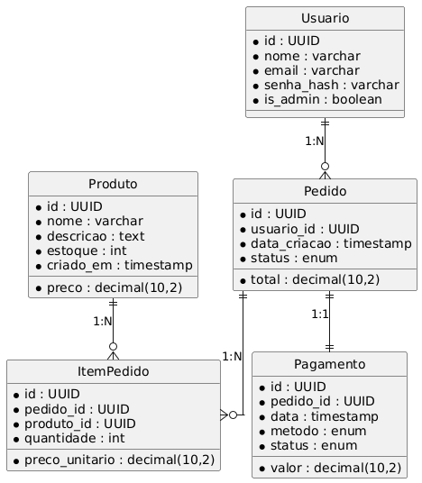

# 🛍️ TechCommerce

    

> **MVP de e‑commerce** escrito em **Python 3.12** + **Django 4.2**, containerizado com Docker. Autenticação JWT, DER documentado e suíte de testes com 98 % de cobertura.

---

## 📑 Sumário

1. [Visão geral](#visão-geral)
2. [Arquitetura](#arquitetura)
3. [Modelagem](#modelagem)
4. [Configuração](#configuração-rápida)
5. [Uso](#uso)
6. [Scripts](#scripts)
7. [Testes](#testes)
8. [API](#api-endpoints)
9. [Query avançada](#query-avançada)
10. [Roadmap](#roadmap)

---

## Visão geral

| 🔹 Recurso             | ✅ Status | Descrição                           |
| ---------------------- | -------- | ----------------------------------- |
| Autenticação SimpleJWT | ✅        | `/api/token/` + refresh             |
| CRUD Produtos          | ✅        | Admin cria/edita; lista pública     |
| Pedidos & Itens        | ✅        | Fluxo de compra, estoque decrementa |
| Pagamento (mock)       | ❌        | Endpoint de confirmação (próximo)   |
| Testes Pytest          | ✅        | 6 testes, 98 % coverage             |
| Docker Compose         | ✅        | Postgres 16 + Gunicorn WSGI         |

---

## Arquitetura

| Camada        | Tecnologia                  |
| ------------- | --------------------------- |
| UI / Demo     | Bash (`scripts/demo.sh`)    |
| API           | Django REST Framework       |
| Auth          | SimpleJWT                   |
| ORM           | Django ORM (PostgreSQL)     |
| Container     | Docker + Compose            |
| Deploy futuro | GitHub Actions ➜ Docker Hub |



---

## Configuração rápida

```bash
# clonar
git clone https://github.com/user/TechCommerce.git && cd TechCommerce

# build & up
docker compose build
docker compose up -d

# popular base (20 produtos Faker)
ALLOW_SEED=1 docker compose run --rm web python scripts/seed.py

# admin (usuário criado no compose)
open http://localhost:8000/admin/   # login: admin / admin123
```

---

## Uso

### Autenticar & obter token

```bash
TOKEN=$(curl -s -X POST http://localhost:8000/api/token/ \
  -H "Content-Type: application/json" \
  -d '{"username":"admin","password":"admin123"}' | jq -r .access)
```

### Listar produtos

```bash
curl -H "Authorization: Bearer $TOKEN" \
     "http://localhost:8000/api/produtos/?page_size=5" | jq
```

### Criar pedido

```bash
FIRST=$(curl -s -H "Authorization: Bearer $TOKEN" \
   http://localhost:8000/api/produtos/?page_size=1 | jq -r '.[0].id')

curl -X POST -H "Authorization: Bearer $TOKEN" -H "Content-Type: application/json" \
     -d '{"itens":[{"produto_id":"'$FIRST'","quantidade":2}]}' \
     http://localhost:8000/api/pedidos/ | jq
```

> 💡 Automatize com `./scripts/demo.sh`.

---

## Scripts

| 📜 Script         | Ação                                             |
| ----------------- | ------------------------------------------------ |
| `scripts/seed.py` | Insere 20 produtos Faker (`ALLOW_SEED=1` guard)  |
| `scripts/demo.sh` | Smoke test: token → lista produtos → cria pedido |
| `docs/der.puml`   | PlantUML → gera `der.png`                        |

---

## Testes

```bash
docker compose run --rm web pytest   # usa addopts com coverage
```

Saída típica:

```
6 passed – 98% coverage
```

---

## API Endpoints

| 🔗 URL                  | Verbo                | Descrição                       |
| ----------------------- | -------------------- | ------------------------------- |
| `/api/token/`           | POST                 | obter `access` & `refresh`      |
| `/api/token/refresh/`   | POST                 | renovar `access`                |
| `/api/produtos/`        | GET / POST           | lista / cria (admin)            |
| `/api/produtos/<uuid>/` | GET / PATCH / DELETE | detalhe / edição                |
| `/api/pedidos/`         | GET / POST           | lista pedidos do usuário / cria |
| `/api/pedidos/<uuid>/`  | GET / PATCH          | detalhe / atualizar status      |

---

## Query avançada

Com `django‑filter` habilitado:

```bash
# buscar por nome/descrição
GET /api/produtos/?search=caneca

# filtro de preço e estoque
GET /api/produtos/?preco_min=100&preco_max=300&estoque_min=10

# ordenação (mais barato primeiro)
GET /api/produtos/?ordering=preco
```

Para ativar:

```python
# store/views.py
from django_filters.rest_framework import DjangoFilterBackend
from rest_framework import filters as drf
from .filters import ProdutoFilter

filter_backends = [DjangoFilterBackend, drf.SearchFilter, drf.OrderingFilter]
filterset_class = ProdutoFilter
search_fields = ["nome", "descricao"]
ordering_fields = ["preco", "criado_em"]
```

---

## Roadmap

* [ ] Endpoint `/api/pagamentos/confirmar/` (mock) → muda status `PAGO`.
* [ ] GitHub Actions CI (pytest + coverage badge).
* [ ] Pre‑commit (black, isort, flake8, mypy).
* [ ] Docker image multi‑stage com coletor de estáticos.

Contribuições são bem‑vindas! ✨

