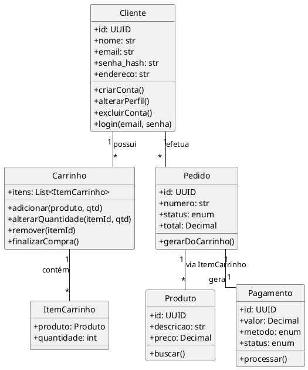

# ShopOnline / TechCommerce – Documentação Completa

> **Versão:** 1.0 – 05 mai 2025
> **Escopo:** atende às 4 etapas definidas no enunciado original: 1) Análise OO, 2) Modelagem Relacional, 3) Implementação SQL e 4) Infraestrutura Ágil.

---

## Etapa 1 – Análise Orientada a Objetos (Diagrama de Classes)

Salve o bloco abaixo como `docs/class_diagram.puml` para gerar `class_diagram.png` via PlantUML.



> **Atributos**: adotamos UUID para chaves, enum para status.
> **Métodos**: indicados os fluxos CRUD típicos e processamento de pagamento.

---

## Etapa 2 – Modelagem de Dados (DER)

O diagrama entidade‑relacionamento está em `docs/der.png` (PlantUML `der.puml`).  Ele contempla as tabelas requeridas:

| Tabela            | Chave Primária | Campos relevantes                                          |
| ----------------- | -------------- | ---------------------------------------------------------- |
| **usuarios**      | `id` (UUID)    | nome, email\*, senha\_hash, endereco                       |
| **produtos**      | `id` (UUID)    | descricao, preco, estoque, criado\_em                      |
| **pedidos**       | `id` (UUID)    | usuario\_id FK, data\_criacao, status, total               |
| **pagamentos**    | `id` (UUID)    | pedido\_id FK, valor, metodo, status                       |
| **itens\_pedido** | `id` (UUID)    | pedido\_id FK, produto\_id FK, quantidade, preco\_unitario |

`itens_pedido` faz o relacionamento N\:M entre **pedidos** e **produtos**.

---

## Etapa 3 – Implementação SQL (PostgreSQL)

Arquivo sugerido `sql/schema.sql` ⇒ execute com `psql -U tech -d techcommerce -f schema.sql`.

```sql
CREATE EXTENSION IF NOT EXISTS "uuid-ossp";

CREATE TABLE usuarios (
    id UUID PRIMARY KEY DEFAULT uuid_generate_v4(),
    nome VARCHAR(120) NOT NULL,
    email VARCHAR(120) UNIQUE NOT NULL,
    senha_hash VARCHAR(255) NOT NULL,
    endereco TEXT,
    criado_em TIMESTAMP DEFAULT CURRENT_TIMESTAMP
);

CREATE TABLE produtos (
    id UUID PRIMARY KEY DEFAULT uuid_generate_v4(),
    descricao TEXT NOT NULL,
    preco NUMERIC(10,2) NOT NULL,
    estoque INTEGER NOT NULL,
    criado_em TIMESTAMP DEFAULT CURRENT_TIMESTAMP
);

CREATE TABLE pedidos (
    id UUID PRIMARY KEY DEFAULT uuid_generate_v4(),
    usuario_id UUID REFERENCES usuarios(id),
    data_criacao TIMESTAMP DEFAULT CURRENT_TIMESTAMP,
    status VARCHAR(12) DEFAULT 'PENDENTE',
    total NUMERIC(12,2) DEFAULT 0
);

CREATE TABLE pagamentos (
    id UUID PRIMARY KEY DEFAULT uuid_generate_v4(),
    pedido_id UUID UNIQUE REFERENCES pedidos(id) ON DELETE CASCADE,
    data TIMESTAMP DEFAULT CURRENT_TIMESTAMP,
    valor NUMERIC(12,2) NOT NULL,
    metodo VARCHAR(10) NOT NULL,
    status VARCHAR(12) DEFAULT 'PENDENTE'
);

CREATE TABLE itens_pedido (
    id UUID PRIMARY KEY DEFAULT uuid_generate_v4(),
    pedido_id UUID REFERENCES pedidos(id) ON DELETE CASCADE,
    produto_id UUID REFERENCES produtos(id),
    quantidade INTEGER NOT NULL,
    preco_unitario NUMERIC(10,2) NOT NULL
);

-- Índices auxiliares
CREATE INDEX idx_pedido_usuario ON pedidos(usuario_id);
CREATE INDEX idx_item_pedido_produto ON itens_pedido(produto_id);
```

*(Nosso projeto Django já gera essas tabelas via migrations; script fornecido para documentação.)*

---

## Etapa 4 – Plano de Infraestrutura Ágil

| Objetivo                                                        | Estratégia                                                                        |
| --------------------------------------------------------------- | --------------------------------------------------------------------------------- |
| **Escalabilidade**                                              | • Hospedagem em **AWS Fargate** (ECS) – serverless containers                     |
| • **Auto Scaling** horizontal por métrica CPU/RPS               |                                                                                   |
| • **RDS Aurora PostgreSQL** com réplicas de leitura             |                                                                                   |
| • **Elastic Load Balancer** distribui tráfego                   |                                                                                   |
| **Modularidade**                                                | • Serviços independentes: *auth*, *store-api*, *checkout*, *worker* (fila Celery) |
| • Comunicação via gRPC/REST; cada módulo em container separado  |                                                                                   |
| • Versionamento de API com gateway (e.g. Kong)                  |                                                                                   |
| **Segurança**                                                   | • TLS término no ELB                                                              |
| • Secrets em AWS Secrets Manager                                |                                                                                   |
| • JWT assinados por chave RS256                                 |                                                                                   |
| • Proteção WAF contra SQLi/XSS, *rate‑limiting* no gateway      |                                                                                   |
| • Dados pessoais criptografados at‑rest (RDS KMS) e em trânsito |                                                                                   |
| **Observabilidade**                                             | • Logs estruturados → CloudWatch + Loki                                           |
| • Métricas Prometheus + Grafana (CPU, latência, erro 5xx)       |                                                                                   |
| • Tracing OpenTelemetry + X‑Ray                                 |                                                                                   |

---
